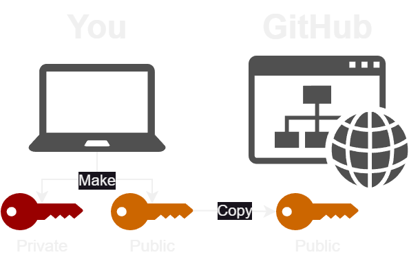
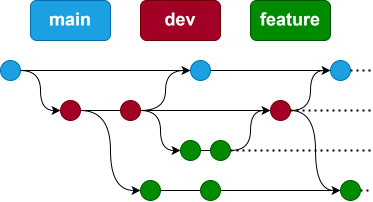

## 0. Introduction


### Before We Start

- Create an account at [github.com](https://www.github.com)
- Open up a terminal


### How This Works

- I'll work through on my machine and you follow along
- Feel free to ask questions!
- Let me know if I'm going too fast

### Exercises

- You do these on your own. When you finish one:
  - **Offline** put a green post-it on your laptop 🟩
  - **Online** 👍 the exercise message in chat
- If you hit a problem:
  - **Offline** put a red post-it note on your laptop 🟥
  - **Online** ✋ raise your hand


## 1. What is Version Control?


### What Does It Do?

- Tracks **changes** to files
- Any file can be tracked
- Text (`.txt`, `.csv`, `.py`, `.c`, `.R`, etc.) works best
  - These allow smart *diff* / *merge* etc.


### Why Use Version Control?

<div style="text-align: left; float: left; width: 45%;">
- A more <ins>efficient</ins> backup
- Reproducibility
</div>
<div style="text-align: right; float: right; width: 45%"></div>


### Why Use Version Control?

- Sharing
- Teamwork


### Version Control Tracks Changes


### Version Control Tracks Changes


### Version Control Tracks Changes


### Version Control Alternatives

- Git
  - Distributed
- Subversion (svn)
  - Centralised
- Mercurial (hg)
  - Distributed

- Git most widely used in academia
  - GitHub
  - GitLab


### Graphical Version Control

<table>
  <tr>
    <th>Sourcetree</th>
    <th>Git Kraken</th>
    <th>Git Desktop</th>
  </tr>
  <tr>
    <td></td>
    <td></td>
    <td></td>
  </tr>
</table>

### GUIs

<table>
  <tr>
    <th>PyCharm</th>
    <th>RStudio</th>
    <th>VS Code</th>
  </tr>
  <tr>
    <td></td>
    <td></td>
    <td></td>
  </tr>
</table>


## 2. Setting Up Git


### Key Commands

- `git config --global user.name "Me"`
- `git config --global user.email "me@email.com"`
- `git config --global core.editor "nano -w"`


### Check It Worked

- `git config --list`

> ```
> user.name=Sam Mangham
> user.email=mangham@gmail.com
> core.editor=nano -w
> [plus much more on Windows]
> ```


### SSH Key Security




### Setting Up GitHub

- Sign up to GitHub: [https://github.com/signup](https://github.com/signup)
- Open a terminal
- `ssh-keygen -t ed25519`
- Accept all the defaults
- `cat ~/.ssh/id_ed25519.pub`
- Copy the contents to GitHub: [https://github.com/settings/ssh/new](https://github.com/settings/ssh/new)
  - *Or use your own if you have one already*


### Expected Outputs

```
Generating public/private ed25519 key pair.
Enter file in which to save the key (/c/Users/Toaster/.ssh/id_ed25519):
Enter passphrase (empty for no passphrase):
Enter same passphrase again:
Your identification has been saved in /c/Users/Toaster/.ssh/id_ed25519
Your public key has been saved in /c/Users/Toaster/.ssh/id_ed25519.pub
The key fingerprint is:
SHA256:<a long string> Toaster@Toast-Nova
The key's randomart image is:
<a square 'picture'>
```


### Checkpoint ☑️

- Everyone set their name and email?
- Everyone have their SSH key on GitHub?
- **Common Problems:**
  - Copying from the terminal - try **right-click -> copy**
  - Changed the save location for `ssh-keygen`


## 3. Creating a Repository


### GitHub Template

- Go to [https://github.com/Southampton-RSG-Training/git-novice-template](https://github.com/Southampton-RSG-Training/git-novice-template)
- "Use This Template"
- Name it `climate-analysis`


### Key Commands

- `git clone git@github.com:yourname/climate-analysis`
- Accept GitHub's SSH key
- `cd climate-analysis`
- `ls -a`
- `git status`


### Expected Outputs

- `git clone <your repo>`

```
Cloning into 'climate-analysis'...
remote: Enumerating objects: 4, done.
remote: Counting objects: 100% (4/4), done.
remote: Compressing objects: 100% (4/4), done.
remote: Total 4 (delta 0), reused 3 (delta 0), pack-reused 0 (from 0)
Receiving objects: 100% (4/4), done.
```


### Expected Outputs

- `git status`

```
# On branch main
nothing to commit, working tree clean
```


### Checkpoint ☑️

- Everyone managed to copy and download the template?
- **Common Problems:**
  - Typo in the command (e.g. missing the `:`)
  - SSH key hasn't been set up
  - Not accepting GitHub's SSH key
  - Not used `cd` to enter `climate-analysis`


## 4. Tracking Changes


### Key Commands

- `nano README.md`
- `Ctrl-O` then `Enter` to save, `Ctrl-X`  to quit
- `git add README.md`
- `git status`
- `git commit -m "Your message"`
- `git status`


### Expected Outputs

- `git add README.md`

If you're on Windows, you might see:

```
warning: in the working copy of 'README.md', LF will be replaced by CRLF the next time Git touches it
```

- `git commit -m "Your message"`

```
[main 3347109] Added a basic readme file
 1 file changed, 4 insertions(+)
 create mode 100644 README.md
```


### Expected Outputs

- `git status`

```
On branch main
Your branch is ahead of 'origin/main' by 1 commit.
  (use "git push" to publish your local commits)

nothing to commit, working directory clean
```


### Checkpoint ☑️

- Everyone created and committed a readme?
- Everyone have "nothing to commit" in the status?
- **Common Problems:**
  - Stuck in `nano` (`Ctrl-O` to save, `Ctrl-X` to quit)
  - Didn't `git add README.md`
  - Forgot the `-m` on commit (write your message in `nano`)


### Adding & Committing

<center>
<div style="width: 60%">

</div>
</center>


### Key Commands

- `git log`


### Expected Outputs

- `git log`

```
commit 334710937654821b3a89996c2c6af476548d28e9 (HEAD -> main)
Author: Sam Mangham <mangham@gmail.com>
Date:   Wed Jan 8 18:40:04 2025 +0000

    Added a basic readme file

commit 3f6b071ef0d35af70793954adb00a3fc7fc7b949 (origin/main, origin/HEAD)
Author: Sam Mangham <mangham@gmail.com>
Date:   Wed Jan 8 18:35:45 2025 +0000

    Initial commit
```

### Key Commands

- `nano climate_analysis.py`
- `git diff`
- `git add climate_analysis.py`
- `git commit -m "Your message"`


### Expected Outputs

- `git diff`

```
diff --git a/climate_analysis.py b/climate_analysis.py
index 277d6c7..347c42b 100644
--- a/climate_analysis.py
+++ b/climate_analysis.py
@@ -1,3 +1,5 @@
+"""Tools for analysing climate data files"""
+
 import sys
 import temp_conversion
 import signal
```

- `git commit`

```
[main 0010185] Add docstring
 1 file changed, 2 insertions(+)
```


### Challenge ✏️

- Use `nano` to edit `climate_analysis.py`
- Add "`# TODO: Add rainfall processing code`" to the end
- Commit the change to the repository


### Solution 👁️

- `nano climate_analysis.py`
- `git diff`
- `git add climate_analysis.py`
- `git commit -m "Your message"`


## 5. Exploring History


### Key Commands

- `git log`
- `git diff HEAD~1 climate_analysis.py`
- `git diff HEAD~2 climate_analysis.py`


### Expected Outputs

- `git log`

```
commit ed664c6d480f93829608791f3d8158f2dcab4107 (HEAD -> main)
Author: Sam Mangham <mangham@gmail.com>
Date:   Thu Jan 9 10:11:27 2025 +0000

    Added rainfall processing placeholder

commit 001018547c0245fd7aa18ca2b694095da34cfc8e
Author: Sam Mangham <mangham@gmail.com>
Date:   Thu Jan 9 10:10:31 2025 +0000

    Add docstring

commit 334710937654821b3a89996c2c6af476548d28e9
Author: Sam Mangham <mangham@gmail.com>
Date:   Wed Jan 8 18:40:04 2025 +0000

    Added a basic readme file

commit 3f6b071ef0d35af70793954adb00a3fc7fc7b949 (origin/main, origin/HEAD)
Author: Sam Mangham <mangham@gmail.com>
Date:   Wed Jan 8 18:35:45 2025 +0000

    Initial commit
```


### Expected Outputs

- `git diff HEAD~1 climate_analysis.py`

```
diff --git a/climate_analysis.py b/climate_analysis.py
index 347c42b..ce8ef32 100644
--- a/climate_analysis.py
+++ b/climate_analysis.py
@@ -27,3 +27,6 @@ for line in climate_data:
             kelvin = temp_conversion.fahr_to_kelvin(fahr)

             print(str(celsius)+", "+str(kelvin))
+
+# TODO: Add rainfall processing code
+
```


### Challenge ✏️

- Get the ID of your first commit
- Get a summary of the changes to `climate_analysis.py` since then


### Solution 👁️

- `git log`
- Take the first 7 characters of the last commit
- `git diff <COMMIT ID> climate_analysis.py`


### More Differences


### Key Commands

- `rm climate_analysis.py`
- `git status`
- `git restore climate_analysis.py`
- *If `restore` doesn't work, try `checkout`*


### Expected Outputs

- `git status`

```
On branch main
Your branch is ahead of 'origin/main' by 3 commits.
  (use "git push" to publish your local commits)

Changes not staged for commit:
  (use "git add/rm <file>..." to update what will be committed)
  (use "git restore <file>..." to discard changes in working directory)
        deleted:    climate_analysis.py

no changes added to commit (use "git add" and/or "git commit -a")
```


### Advanced Use

- `git checkout <COMMIT ID> climate_analysis.py`


### Restoring Files

<center>
<div style="width: 70%">

</div>
</center>


## 6. Remote Repositories


### Local Repo

<center>
<div style="width:50%;"></div>
</center>


### Remote Backups

<center>

<div style="width: 65%"></div>

</center>

### Collaboration


### Key Commands

- `git push`
- Accept GitHub's SSH key if asked


### Expected Output

- `git push`

```
Counting objects: 11, done.
Delta compression using up to 32 threads.
Compressing objects: 100% (9/9), done.
Writing objects: 100% (9/9), 1.11 KiB | 0 bytes/s, done.
Total 9 (delta 2), reused 0 (delta 0)
remote: Resolving deltas: 100% (2/2), completed with 1 local object.
To git@github.com:smangham/climate-analysis
   70bf8f3..501e88f  main -> main
```


### Checkpoint ☑️

- Everyone successfully pushed to GitHub?
- **Common Problems:**
  - Cloned with `https` rather than `ssh`


### Conflict Creation

**Local:**

- `nano README.md`
- Add your email to the end
- `git commit -am "Your message"`

**Remote:**

- Go to your repo on GitHub
- Edit `README.md` to add install info to the end
- Commit directly to `main`


### Conflict Creation

- `git push`


### Expected Outputs

- `git push`

```
To git@github.com:smangham/climate-analysis
 ! [rejected]        main -> main (fetch first)
error: failed to push some refs to 'git@github.com:smangham/climate-analysis'
hint: Updates were rejected because the remote contains work that you do
hint: not have locally. This is usually caused by another repository pushing
hint: to the same ref. You may want to first merge the remote changes (e.g.,
hint: 'git pull') before pushing again.
hint: See the 'Note about fast-forwards' in 'git push --help' for details.
```


### Checkpoint ☑️

- Everyone managed to edit both the local and remote `main` branches?


### Conflict Resolution

- `git pull`
- `git config pull.rebase false` if it fails
- `nano README.md` and remove the `<<<`/`===`/`>>>`
- `git add README.md`
- `git commit -am "Your message"`
- `git push`


### Expected Outputs

- `git pull`

```
remote: Enumerating objects: 5, done.
remote: Counting objects: 100% (5/5), done.
remote: Compressing objects: 100% (3/3), done.
remote: Total 3 (delta 0), reused 0 (delta 0), pack-reused 0
Unpacking objects: 100% (3/3), done.
From github.com:smangham/climate-analysis
   501e88f..023f8f6  main       -> origin/main
Auto-merging README.md
CONFLICT (content): Merge conflict in README.md
Automatic merge failed; fix conflicts and then commit the result.
```


### Checkpoint ☑️

- Everyone managed to create a conflict, then fix it?
- **Common Problems:**
  - Not committing the changes to your local repo before pulling
  - Committing your remote changes to a different branch


### Remote Commands

<center>
<div style="width: 60%"></div>
</center>


## 7. Branches


### Branching Workflows

<center>

</center>


### Feature Branch

<center>

</center>


### Creating branches

- `git branch`
- `git branch dev`
- `git switch dev`
- *If `switch` doesn't work, try `checkout`*


### Expected Outputs

- `git switch dev`

```
Switched to branch `dev`
```
- If `git switch dev` doesn't work, try `git checkout dev`


### Branch files

- `nano rainfall_conversion.py`
- `git add rainfall_conversion.py`
- `git commit -m "Your message"`
- `ls`
- `git log`


### Switching Branches

- `git switch main`
- `ls`
- `git log`


### Pushing Branches

- `git switch dev`
- `git push origin dev`
- `git config --global push.autoSetupRemote true`


### Expected Outputs

- `git push origin dev`

```
Enumerating objects: 25, done.
Counting objects: 100% (25/25), done.
Delta compression using up to 20 threads
Compressing objects: 100% (25/25), done.
Writing objects: 100% (25/25), 4.40 KiB | 2.20 MiB/s, done.
Total 25 (delta 6), reused 3 (delta 0), pack-reused 0
remote: Resolving deltas: 100% (6/6), done.
remote:
remote: Create a pull request for 'dev' on GitHub by visiting:
remote:      https://github.com/smangham/climate-analysis/pull/new/dev
remote:
To github.com:smangham/climate-analysis
 * [new branch]      dev -> dev
```


### Checkpoint ☑️

- Everyone managed to create and push a branch?
- **Common Problems:**
  - Not pushing to `origin dev`
  - Committing to `main` not `dev`


### Merging Branches

- `git switch main`
- `git merge dev`


## 8. Ignoring Things


### Create Temporary Files

- `git switch dev`
- `mkdir results`
- `touch example.csv results/example.txt`
- `git status`


### Expected Outputs

- `git status`

```
On branch dev
Your branch is up to date with 'origin/dev'.

Untracked files:
  (use "git add <file>..." to include in what will be committed)
        example.csv
        results/example.txt

nothing added to commit but untracked files present (use "git add" to track)
```


### Create Git Ignore

- `nano .gitignore`
- Lines for `*.csv` and `results/`
- `git status`
- `git add .gitignore`
- `git commit -m "Your message"`


### Expected Outputs

- `git status`

```
On branch dev
Your branch is up to date with 'origin/dev'.

Untracked files:
  (use "git add <file>..." to include in what will be committed)
        .gitignore

nothing added to commit but untracked files present (use "git add" to track)
```
