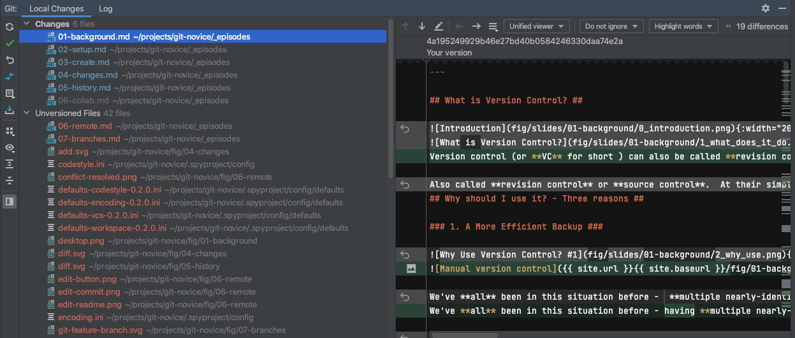
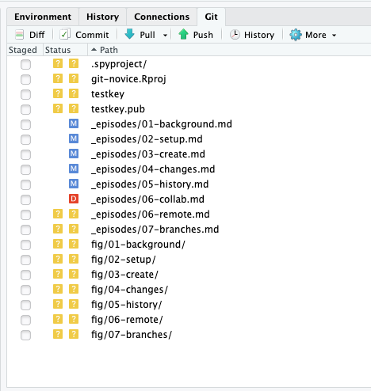
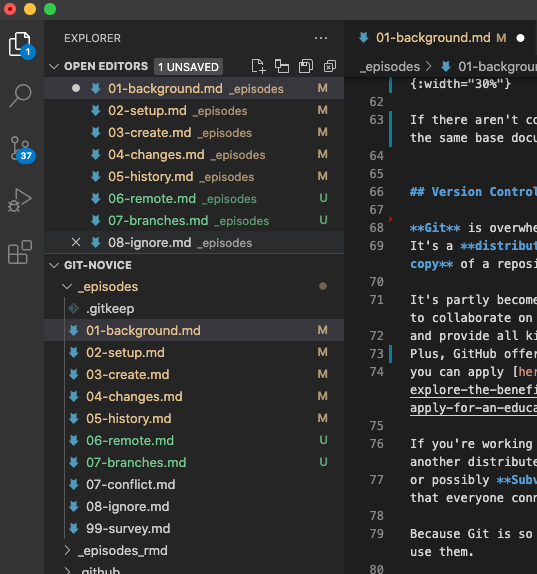
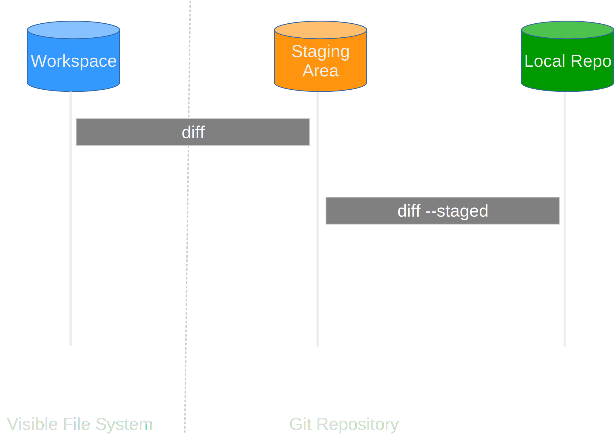
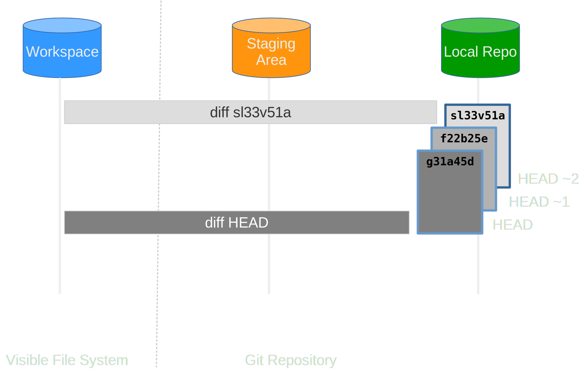
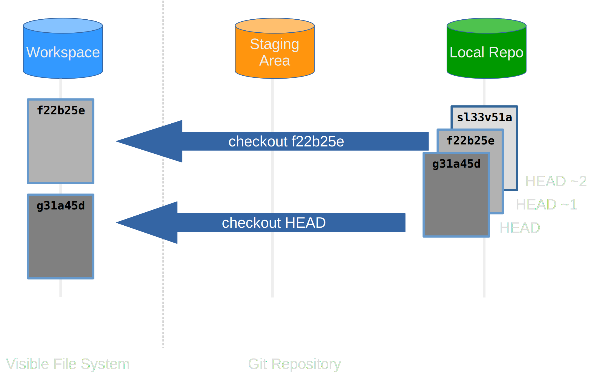
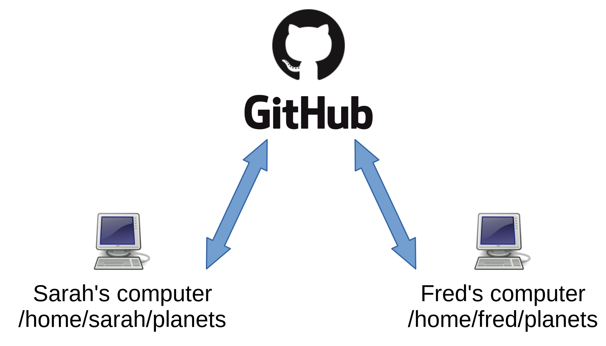

## Version Control with Git

## 0. Introduction

### Before We Start

- Create an account at [github.com](https://www.github.com)
- Open up a terminal

## 1. What is Version Control?

### What Does It Do?

- Tracks **changes** to files
- Any file can be tracked
- Text (.txt, .csv, .py, .c, .R, etc.) works best
  - These allow smart *diff* / *merge* etc.

### Why Use Version Control?

- A more <ins>efficient</ins> backup
- Reproducibility

### Why Use Version Control?

- Teamwork

### Version Control Tracks Changes

### Version Control Tracks Changes

### Version Control Tracks Changes

### Version Control Alternatives

- Git
  - Distributed
- Subversion (svn)
  - Centralised
- Mercurial (hg)
  - Distributed

- Git most widely used in academia
  - GitHub
  - GitLab

### Graphical Version Control

<table>
  <tr>
    <th>Sourcetree</th>
    <th>Git Kraken</th>
    <th>Git Desktop</th>
  </tr>
  <tr>
    <td></td>
    <td></td>
    <td></td>
  </tr>
</table>

### GUIs

<table>
  <tr>
    <th>PyCharm</th>
    <th>RStudio</th>
    <th>VS Code</th>
  </tr>
  <tr>
    <td></td>
    <td></td>
    <td></td>
  </tr>
</table>

## 2. Setting Up Git

### Key Commands

- `git config`

### Setting Up GitHub

- Sign up to GitHub: [https://github.com/signup](https://github.com/signup)
- Open a terminal
- `ssh-keygen -t ed25519`
- `cat ~/.ssh/id_ed25519.pub`
- Copy the contents to GitHub: [https://github.com/settings/ssh/new](https://github.com/settings/ssh/new)

## 3. Creating a Repository

### GitHub Template

- Go to [https://github.com/Southampton-RSG-Training/git-novice-template](https://github.com/Southampton-RSG-Training/git-novice-template)
- "Use This Template"
- Name it `climate-analysis`

### Downloading a Repository

- `git clone git@github.com:yourname/climate-analysis`

## 4. Tracking Changes

### Key Commands

- `git add`
- `git commit`

### Adding & Committing

### History

- `git log`
- `git diff`

### Differences

## 5. Exploring History

### More Differences

### Restoring Files

- `git checkout`

### Restoring Files

## 6. Remote Repositories

### Local Repo

### Remote Backups

### Collaboration

### Remote Repositories

- `git push`
- `git pull`

### Remote Commands

## 7. Branches

### Feature-branch

### Creating branches

- `git branch dev`
- `git checkout dev`

### Branch files

- Create `rainfall_conversion.py`
- `git add rainfall_conversion.py`
- `git commit -m`

### Pushing & merging

- `git push origin dev`
- `git switch main`
- `git merge dev`

## 8. Ignoring Things

### Key Files

- `.gitignore`
- `.gitkeep`
